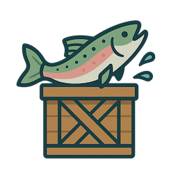

<p align="center">
    
    <p align="center"><em>Every trout is delivered.</em></p>
</p>

# Go Transactional Outbox Library

[](https://github.com/Darkemon/troutbox/actions)

The **Go Transactional Outbox Library** is a robust implementation of the **Outbox Pattern** for reliable message delivery in distributed systems. It ensures that messages are stored in a database and sent at least once to a message broker (e.g., RabbitMQ, Kafka) in a fault-tolerant and transactional manner.

## Usage

Here is a simple example of how to use the library:

```go
import (
    "context"
    "github.com/Darkemon/troutbox"
    "github.com/Darkemon/troutbox/adapter/psql"
)

var (
    db *sql.DB             // your database connection
    sender troutbox.Sender // your message sender implementation
)

// Create psql implementation of the repository.
// The second argument is lock id for partitioning job.
// It is used to prevent multiple instances of the application
// from running the partitioning job at the same time.
repo, err := psql.NewPostgresMessageRepository(db, 12345)

// Create necessary tables.
err := repo.Migrate(ctx)

// Run a job to create/remove partitions.
go func() {
    err := repo.RunPartitioningJob(ctx)
    // ...
}()

// Create a new outbox instance and run it.
outbox := troutbox.NewOutbox(repo, sender)

go func() {
    err := outbox.Run(ctx)
    // ...
}()

// Add a message to the outbox.
tr := db.BeginTx(ctx, nil)
err := outbox.AddMessage(ctx, tr, "my-key", []byte("my-value"))
// ...
tr.Commit() // or tr.Rollback()
```

For more detailed example, please refer to the [examples](./examples/) directory.  
See [adapter](./adapter/) directory for repository implementations.

## Features

- **Distributed Systems Support**: Designed to work seamlessly in distributed environments.
- **Transactional Support**: Ensures messages are added to the outbox and processed reliably within database transactions.
- **Retry Logic**: Automatically retries failed messages up to a configurable limit.
- **Dead Letter Handling**: Marks messages as dead if they exceed the retry limit, ensuring they are not retried indefinitely.
- **Extensibility**: Easily integrates with different storage backends (e.g., PostgreSQL, MySQL) and message brokers (e.g., RabbitMQ, Kafka).
- **OpenTelemetry Integration**: Provides observability with metrics and tracing.
- **Customizable**: Configurable batch size, retry limits and error handlers.

## Installation

To install the library, run:

```bash
go get github.com/Darkemon/troutbox
```

## Observability
The library provides OpenTelemetry traces and metrics for monitoring the status of the outbox.

The following metrics are available:
- `outbox_messages_sent`: (counter) the total number of messages sent to the message broker.
- `outbox_messages_failed`: (counter) the total number of messages that failed to be sent.
- `outbox_messages_retried`: (counter) the total number of messages that were retried.
- `outbox_messages_dead`: (counter) the total number of messages that were marked as dead.

Take into account that the counters might be not 100% accurate in case when there are issues with database connection.
